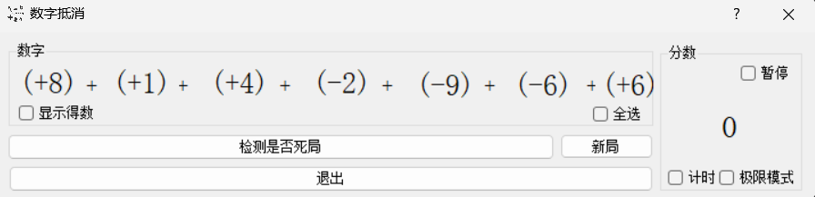

# NumberGame

***数字抵消小游戏***

## 玩法

打开软件后可以看到左上方的横式，右上方的分数，下方有两个按钮  
  
选择一些加起来等于0的数字（单独一个0也可以，或者-3，-2，+5这三个数也可以，不限次数）  
  
选择好后，下方的*检测是否死局*按钮会变成*抵消*  
如果所有选择的数相加等于0，按下*抵消*按钮即可得1分，如果选错了会**结束游戏**  
如果觉得陷入了死局，可以按下*检测是否死局*，如确实死局，可以重新生成一次，如没有，将会**结束游戏**  

***玩法就这么简单，但你别看它一开始特别简单，如果你对数字不敏感，到后面你就会发现它特别难...***  

***作者的最高分（未作弊）：**13*  
~~其实左上角的问号里有提示，但是真的不建议使用（毕竟这么简单的游戏还要用帮助...）~~